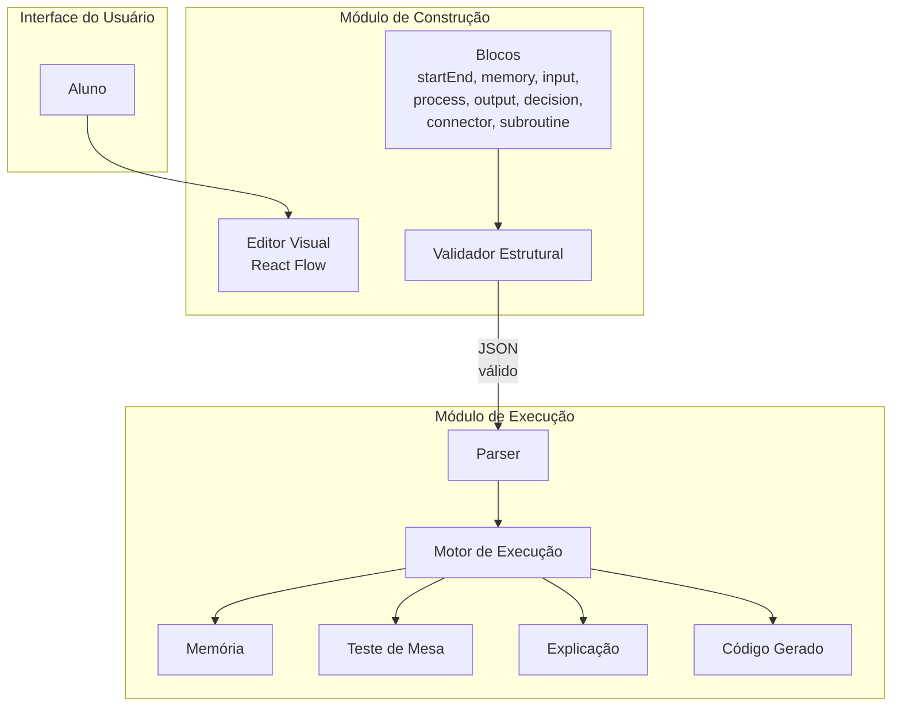
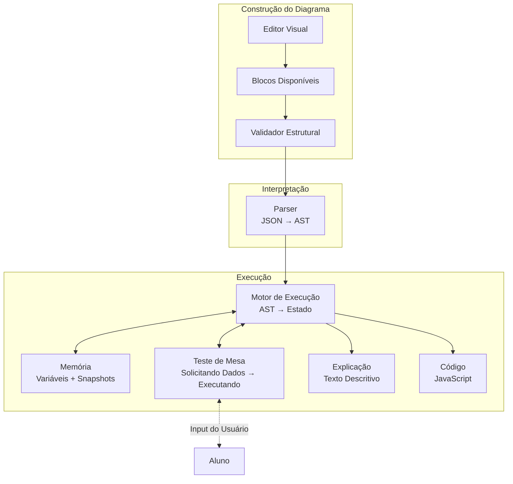
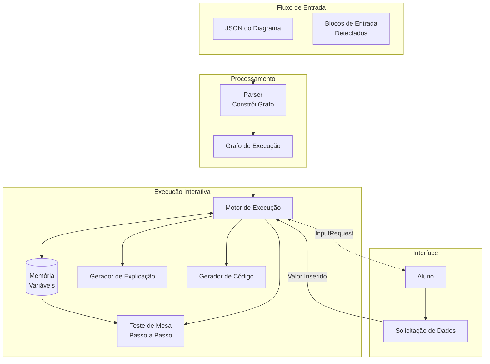
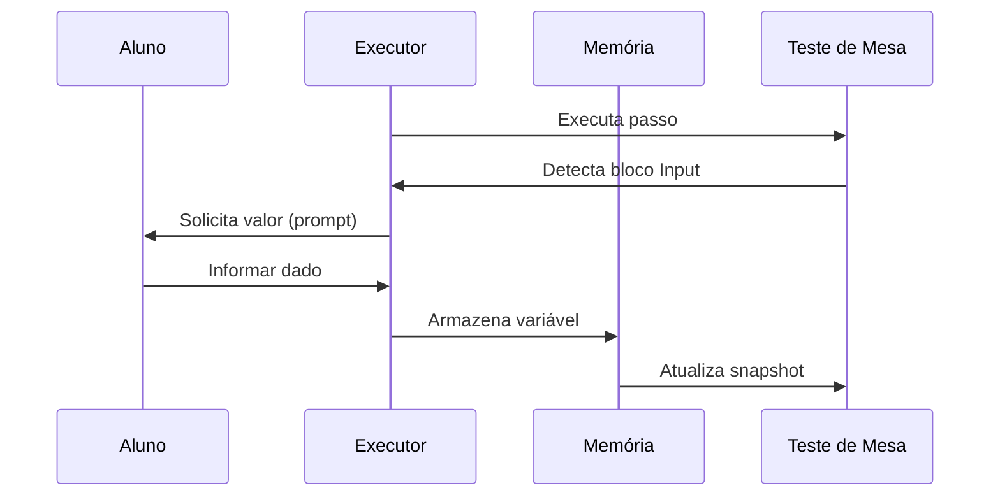
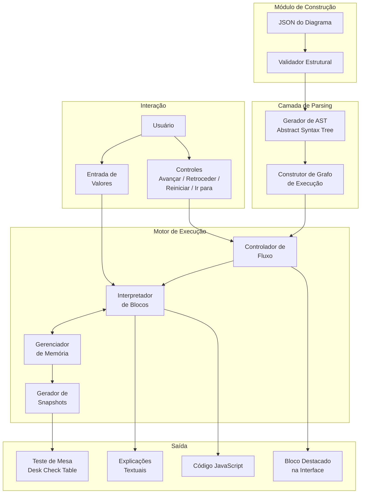
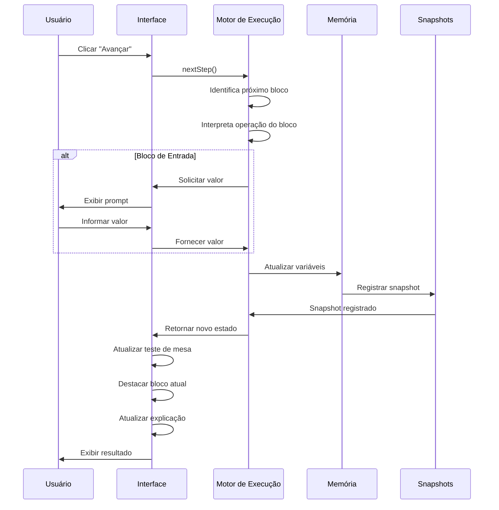
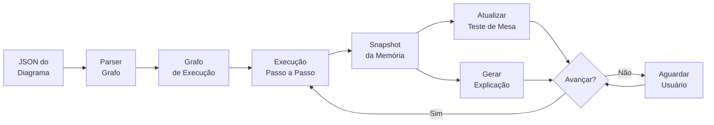

# 📄 Software Design Document (SSD)

**Projeto:** Blade – Plataforma de Ensino de Algoritmos por Diagramas de Blocos

**Autores:**
- Lucas Gontarz Fajardo
- Emanuel Oliveira Andrade

**Versão:** 2.0.0

**Status:** 🟡 Em Desenvolvimento

---

# 1. Introdução

Este documento apresenta a arquitetura de software do Blade, descrevendo a organização dos principais componentes do sistema e o fluxo de funcionamento da aplicação.

O objetivo deste documento é fornecer uma visão técnica da solução proposta, demonstrando como os módulos do sistema interagem para permitir a construção, interpretação e execução de algoritmos representados por Diagramas de Blocos.

Este documento não aborda detalhes de banco de dados, infraestrutura ou implementação específica de código, concentrando-se apenas na arquitetura lógica da aplicação.

---

# 2. Objetivos da Arquitetura

A arquitetura do Blade foi projetada visando:

- Separação clara de responsabilidades;
- Facilidade de manutenção;
- Modularização do sistema;
- Facilidade para futuras expansões;
- Reutilização de componentes;
- Independência entre construção e execução dos algoritmos.

---

# 3. Visão Geral do Sistema

O Blade é composto por dois módulos principais que trabalham de forma integrada.

- Módulo de Construção de Diagramas
- Módulo de Execução e Teste de Mesa

O primeiro é responsável pela criação e edição dos algoritmos.

O segundo interpreta o algoritmo criado, executa sua lógica e apresenta os resultados da simulação ao usuário.

---

# 4. Arquitetura Geral



A arquitetura foi organizada em módulos independentes, permitindo que alterações em um módulo causem o mínimo impacto possível nos demais.

## Stack Tecnológica e Versões

| Camada | Tecnologia | Versão |
|----------|------------|--------|
| Runtime | Ruby | 3.4.10 |
| Framework Web | Ruby on Rails | 8.1.3 |
| Servidor Web | Puma | >= 5.0 |
| Frontend | React | 19.2.7 |
| Linguagem Frontend | TypeScript | 6.0.3 |
| Editor Visual | @xyflow/react (React Flow) | 12.11.1 |
| Bundler JS | esbuild | 0.28.1 |
| Testes Frontend | Vitest | 4.1.10 |
| Estilização | Tailwind CSS | 4.3.2 |
| Hotwire (Turbo) | @hotwired/turbo-rails | 8.0.23 |
| Hotwire (Stimulus) | @hotwired/stimulus | 3.2.2 |
| Banco de Dados | PostgreSQL | 16 |
| Driver BD | pg gem | ~> 1.1 |
| Deploy | Kamal | - |
| Versionamento | Git + GitHub | - |
| Containerização | Docker + Docker Compose | - |

---

# 5. Componentes do Sistema

## Interface do Usuário

Responsável pela interação entre o usuário e a plataforma.

Permite:

- construir diagramas;
- executar algoritmos;
- acompanhar a execução;
- visualizar os resultados.

---

## Módulo de Construção

Responsável pela modelagem visual dos algoritmos.

Principais responsabilidades:

- criação dos blocos;
- edição;
- conexões;
- organização do diagrama.

Ao final da modelagem, produz um diagrama estruturado que será enviado ao módulo de execução.

---

## Módulo de Execução

Responsável por interpretar o diagrama recebido.

Este módulo realiza:

- interpretação;
- execução passo a passo;
- atualização da memória;
- geração do teste de mesa;
- geração das explicações;
- conversão para código.

---

# 6. Fluxo Geral de Funcionamento

O funcionamento do Blade ocorre conforme o fluxo abaixo.



Após a construção do algoritmo, o módulo de construção realiza sua validação estrutural.

Caso o diagrama seja considerado válido, o módulo de execução inicia a interpretação do algoritmo.

Durante a execução, o sistema atualiza continuamente a memória, gera o teste de mesa, produz explicações textuais e disponibiliza o código equivalente.

---

# 7. Módulo de Construção de Diagramas

Este módulo é responsável pela elaboração visual do algoritmo.

Suas principais funções são:

- disponibilizar os blocos da linguagem;
- permitir conexões entre blocos;
- editar propriedades dos elementos;
- validar regras básicas da construção;
- fornecer ao módulo de execução um diagrama consistente.

Este módulo não realiza qualquer processamento lógico do algoritmo.

---

# 8. Módulo de Execução e Teste de Mesa

O módulo de execução constitui o núcleo funcional da plataforma.

Seu objetivo é interpretar o algoritmo representado pelo diagrama e executar cada instrução de forma semelhante ao funcionamento de um interpretador.

Durante a execução o sistema:

- identifica o bloco atual;
- interpreta sua operação;
- atualiza as variáveis;
- registra o estado da memória;
- produz um novo passo do teste de mesa;
- gera uma explicação da operação executada.

---

# 9. Fluxo de Execução



O diagrama é inicialmente interpretado pelo Parser.

Em seguida, o Motor de Execução percorre os blocos seguindo o fluxo definido pelo algoritmo.

A cada instrução executada, a memória é atualizada e novos resultados são produzidos.

---

# 9.1. Formato JSON do Diagrama

O construtor envia o diagrama ao módulo de execução com formato compatível com `@xyflow/react` (React Flow). Os nós (`nodes`) seguem o tipo `Node` da biblioteca, e as arestas (`edges`) seguem o tipo `Edge`, com campos adicionais de handle e label para controle de fluxo.

**Tipos de bloco:**

| `type` | `variant` | Gera passo? | Descrição |
|----------|-----------|-------------|-----------|
| `startEnd` | `'start'` | Sim | Início do algoritmo |
| `startEnd` | `'end'` | Sim | Término do algoritmo |
| `memory` | — | **Não** | Declaração de variáveis (tipo + nome) |
| `input` | — | Sim | Entrada de dados do usuário |
| `output` | — | Sim | Exibição de dados |
| `process` | — | Sim | Atribuição / processamento |
| `decision` | — | Sim | Desvio condicional (handles `'yes'`/`'no'`) |
| `connector` | — | **Não** | Roteamento de fluxo (1 entrada, 1 saída) |
| `subroutine` | — | Sim | Chamada de sub-rotina |

**Formato dos nós:**

```typescript
interface Node {
  id: string              // ex: "n1", "n2"
  type: string            // "startEnd" | "memory" | "input" | "output" | "process" | "decision" | "connector" | "subroutine"
  position: { x: number; y: number }
  data: {
    label?: string        // Texto exibido no bloco
    variant?: 'start' | 'end'  // Apenas para type = "startEnd"
    rows?: Array<{        // Apenas para type = "memory"
      type: string        // "inteiro" | "real" | "caractere" | "logico"
      variables: string   // "num1, num2, soma" ou "notas[5], i"
    }>
  }
}
```

**Formato das arestas:**

```typescript
interface Edge {
  id: string              // ex: "e1", "e2"
  source: string          // id do nó origem
  target: string          // id do nó destino
  sourceHandle?: string   // "yes" | "no" (decisão) | "bottom-out" | "right-in" | etc
  targetHandle?: string   // "top-in" | "left-in" | "right-in" | etc
  label?: string          // "VERDADEIRO" | "FALSO" (exibido na aresta)
  type?: string           // "default" | "smoothstep"
}
```

**Exemplo completo (soma de dois números):**

```json
{
  "nodes": [
    { "id": "n1", "type": "startEnd", "position": { "x": 250, "y": 0 }, "data": { "label": "Início", "variant": "start" } },
    { "id": "n2", "type": "memory", "position": { "x": 220, "y": 80 }, "data": { "label": "Memória", "rows": [{ "type": "inteiro", "variables": "num1, num2, soma" }] } },
    { "id": "n3", "type": "input", "position": { "x": 240, "y": 200 }, "data": { "label": "num1, num2" } },
    { "id": "n4", "type": "process", "position": { "x": 230, "y": 310 }, "data": { "label": "soma = num1 + num2" } },
    { "id": "n5", "type": "output", "position": { "x": 240, "y": 420 }, "data": { "label": "\"A soma é: \" + soma" } },
    { "id": "n6", "type": "startEnd", "position": { "x": 250, "y": 530 }, "data": { "label": "Fim", "variant": "end" } }
  ],
  "edges": [
    { "id": "e1", "source": "n1", "target": "n2" },
    { "id": "e2", "source": "n2", "target": "n3" },
    { "id": "e3", "source": "n3", "target": "n4" },
    { "id": "e4", "source": "n4", "target": "n5" },
    { "id": "e5", "source": "n5", "target": "n6" }
  ]
}
```

---

# 9.2. Fluxo de Solicitação de Dados

Quando o teste de mesa encontra um bloco de **Entrada**, o fluxo é:



# 10. Sistema para Simulação de Teste de Mesa em Diagrama de Blocos

O **Sistema para Simulação de Teste de Mesa em Diagrama de Blocos** é o motor central da plataforma Blade. Ele interpreta o diagrama construído pelo usuário, executa as instruções do algoritmo, gerencia o estado da memória e produz toda a saída didática da plataforma: teste de mesa, explicações e código-fonte.

## 10.1. Arquitetura do Motor de Execução



O motor de execução é composto por quatro subsistemas que trabalham em conjunto:

### Controlador de Fluxo

Responsável por determinar qual bloco deve ser executado a cada passo. Ele percorre o grafo de execução seguindo as arestas, avaliando condições em blocos de decisão e gerenciando laços de repetição.

Funcionalidades:
- Navegação sequencial entre blocos;
- Avaliação de expressões condicionais para desvios (handles `'yes'`/`'no'`);
- Detecção de ciclos no grafo para implementação de laços (while/for) via `decision` + arestas de retorno + `connector`;
- Detecção de término de execução.

### Interpretador de Blocos

Responsável por executar a operação específica de cada tipo de bloco. Cada tipo de bloco possui um handler especializado que sabe como interpretar sua operação.

Tipos de blocos interpretados:

| Node `type` | Tipo | `variant` | Gera passo? | Operação |
|--------------|------|-----------|-------------|----------|
| `startEnd` | Início | `'start'` | Sim | Marca o ponto de partida |
| `memory` | Memória | — | **Não** | Declara variáveis com tipo e nome (não gera snapshot) |
| `input` | Entrada | — | Sim | Solicita valor ao usuário e armazena em variável |
| `process` | Processo | — | Sim | Executa expressão de atribuição (pode conter múltiplos statements separados por `;`) |
| `decision` | Decisão | — | Sim | Avalia condição booleana; saídas pelos handles `'yes'` (VERDADEIRO) e `'no'` (FALSO) |
| `output` | Saída | — | Sim | Exibe valor ou mensagem |
| `subroutine` | Sub-rotina | — | Sim | Executa chamada de sub-rotina/função |
| `connector` | Conector | — | **Não** | Roteia fluxo (1 entrada, 1 saída; não gera snapshot) |
| `startEnd` | Término | `'end'` | Sim | Finaliza a execução |

### Gerenciador de Memória

Mantém o estado atual de todas as variáveis do algoritmo durante a execução. As variáveis são **declaradas** no bloco `memory` (com tipo e nome) e **inicializadas** posteriormente via blocos `input` ou `process`.

Variáveis indexadas (vetores) são declaradas como `nome[tamanho]` (ex: `notas[5]`) e acessadas via índice (ex: `notas[i]`).

Estrutura:

```json
{
  "variables": {
    "n": 10,
    "soma": 15,
    "contador": 3
  },
  "declared": ["n", "soma", "contador"],
  "initialized_at": ["n", "soma", "contador"],
  "types": {
    "n": "inteiro",
    "soma": "real",
    "contador": "inteiro"
  }
}
```

Operações:
- **Declarar variável**: registra variável a partir do bloco `memory` (nome, tipo, e se é vetor);
- **Inicializar variável**: atribui valor pela primeira vez (via `input` ou `process`);
- **Atualizar variável**: modifica o valor de uma variável existente;
- **Consultar variável**: retorna o valor corrente de uma variável;
- **Verificar inicialização**: valida se a variável foi inicializada antes do uso.

### Gerador de Snapshots

A cada passo da execução, o sistema captura o estado completo e o armazena como um snapshot imutável.

Estrutura de um snapshot:

```json
{
  "step": 3,
  "block_id": "3",
  "block_type": "process",
  "operation": "soma = n + 10",
  "timestamp": 1710456789000,
  "variables": {
    "n": 10,
    "soma": 20
  },
  "output": null,
  "explanation": "Atribuindo à variável 'soma' o valor de 'n' (10) + 10, resultando em 20."
}
```

O conjunto de snapshots forma o histórico completo da execução, permitindo navegação bidirecional entre passos.

---

## 10.2. Fluxo de Execução Detalhado



Cada interação do usuário com os controles de execução dispara uma sequência de operações no motor.

---

## 10.3. Pipeline de Processamento

O pipeline completo de processamento de um diagrama até a geração dos resultados didáticos segue as etapas abaixo:



---

## 10.4. Teste de Mesa (Desk Check Table)

O teste de mesa é a representação tabular da execução do algoritmo, construída automaticamente a partir da sequência de snapshots registrados.

Cada linha do teste de mesa registra:

- **Passo**: número sequencial da execução;
- **Bloco**: identificador e tipo do bloco executado;
- **Operação**: descrição textual da operação realizada pelo bloco;
- **Variáveis**: valores de **todas** as variáveis após a execução do passo (cada variável em sua coluna);
- **Saída**: resultado produzido (para blocos de saída de dados);

Exemplo de teste de mesa gerado:

| Passo | Bloco | Operação | n | soma | contador | Saída |
|-------|-------|----------|---|---|----------|-------|
| 1 | Início | Iniciar algoritmo | - | - | - | - |
| 2 | Entrada | Ler valor para n | 10 | - | - | - |
| 3 | Processo | soma = n + 10 | 10 | 20 | - | - |
| 4 | Saída | Exibir soma | 10 | 20 | - | 20 |
| 5 | Término | Finalizar execução | 10 | 20 | - | - |

As colunas de variáveis são dinâmicas: novas colunas aparecem conforme variáveis são criadas durante a execução.

---

## 10.5. Geração de Explicações

Cada snapshot inclui uma explicação textual gerada automaticamente. A explicação é contextual e depende do tipo de bloco executado:

- **startEnd (start)**: "Iniciando o algoritmo.";
- **startEnd (end)**: "Algoritmo finalizado.";
- **input**: "Solicitando ao usuário um valor para a variável 'n'.";
- **process**: "Calculando a expressão 'soma = n + 10': substituindo 'n' por 10, obtendo soma = 20.";
- **process (múltiplos)**: "Executando: soma = 0; i = 1. Variáveis atualizadas.";
- **decision**: "Avaliando condição 'n > 5': como 10 > 5 é verdadeiro, seguindo pelo ramo VERDADEIRO (handle 'yes').";
- **output**: "Exibindo o valor da variável 'soma': 20.";
- **subroutine**: "Chamando sub-rotina 'fatorial(n)' com n = 5.";
- **memory**: *(não gera explicação — bloco declarativo, sem passo)*;
- **connector**: *(não gera explicação — bloco de roteamento, sem passo)*;

---

## 10.6. Sistema de Navegação entre Passos

O sistema permite que o usuário navegue livremente pelo histórico da execução:

- **Avançar (next)**: executa o próximo bloco e adiciona um novo snapshot ao histórico;
- **Retroceder (prev)**: restaura o estado a partir do snapshot anterior (o snapshot atual não é descartado);
- **Reiniciar (reset)**: descarta todos os snapshots e reinicia a execução a partir do bloco inicial;
- **Ir para passo N**: restaura o estado exato do snapshot N, permitindo que o usuário "pule" para qualquer ponto da execução.

A navegação não altera os snapshots já registrados, garantindo a integridade do histórico de execução.

---

## 10.7. Detecção de Erros de Execução

O sistema detecta e reporta erros durante a simulação que impedem o algoritmo de prosseguir. Erros estruturais (pré-execução) são responsabilidade do módulo de construção.

- Uso de variável não declarada no bloco `memory`;
- Uso de variável declarada mas não inicializada;
- Acesso a índice fora dos limites do vetor declarado;
- Divisão por zero;
- Expressões inválidas ou malformadas;
- Tipo de dado incompatível com a operação;
- Limite máximo de passos excedido (proteção contra loop infinito).

Quando um erro é detectado, a execução é interrompida e uma mensagem descritiva é exibida ao usuário, indicando o bloco onde o erro ocorreu e a natureza do problema.

---

## 10.8. Conversão para Código

Além da execução visual, o Blade realiza a conversão do algoritmo para código-fonte.

Cada bloco do diagrama possui um equivalente na linguagem de programação.

Exemplos:

| Node `type` | Bloco | Código Gerado |
|--------------|--------|---------------|
| `startEnd (start)` | Início | `// Início do algoritmo` (comentário) |
| `memory` | Memória | `let num1, num2, soma;` (declaração `let`, ou `let notas = new Array(5);` para vetores) |
| `input` | Entrada | `num1 = parseInt(prompt(""));` (ou `parseFloat` conforme tipo) |
| `process` | Processo | `soma = num1 + num2;` (atribuição direta) |
| `decision` | Decisão | `if (condição) { } else { }` |
| `output` | Saída | `console.log("A soma é: " + soma);` |
| `subroutine` | Sub-rotina | `resultado = fatorial(n);` |
| `connector` | Conector | *(nada — apenas roteamento de fluxo)* |
| `startEnd (end)` | Término | `// Fim do algoritmo` (comentário) |

O objetivo é facilitar a transição entre programação visual e programação textual.

# 11. Divisão dos Módulos

Para fins de desenvolvimento do Trabalho de Conclusão de Curso, a plataforma foi dividida em dois módulos.

## Módulo de Construção

Responsável:
**Emanuel Oliveira Andrade**

Escopo:

- Editor visual;
- Inserção de blocos;
- Conexões;
- Validação estrutural (pré-execução);
- Modelagem do algoritmo.

---

## Módulo de Execução

Responsável:
**Lucas Gontarz Fajardo**

Escopo:

- Interpretação;
- Execução passo a passo;
- Teste de mesa;
- Atualização da memória;
- Explicação da execução;
- Conversão para código.

Embora desenvolvidos separadamente, ambos os módulos compõem uma única aplicação.

---

# 12. Considerações Finais

A arquitetura proposta para o Blade foi organizada de forma modular, permitindo a separação entre a construção dos algoritmos e sua execução.

Essa divisão reduz o acoplamento entre os componentes, facilita futuras manutenções e possibilita a evolução independente de cada módulo.

Além disso, a arquitetura favorece a expansão da plataforma, permitindo a inclusão de novos blocos, novas linguagens de programação e novas funcionalidades sem alterações significativas na estrutura principal do sistema.