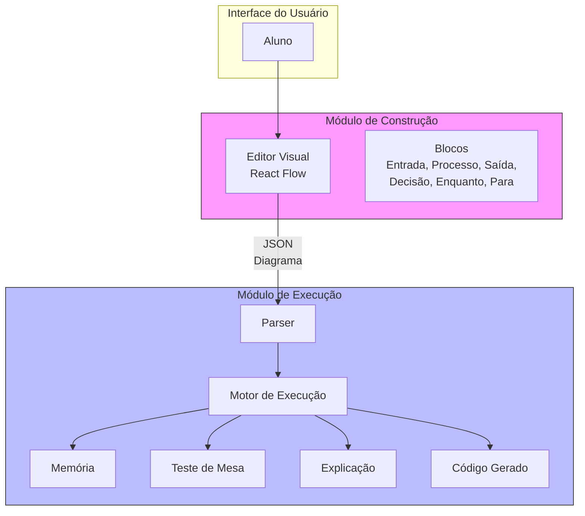
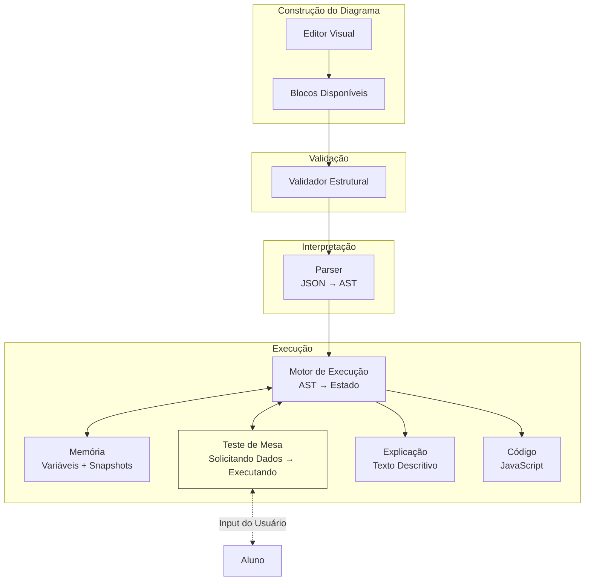
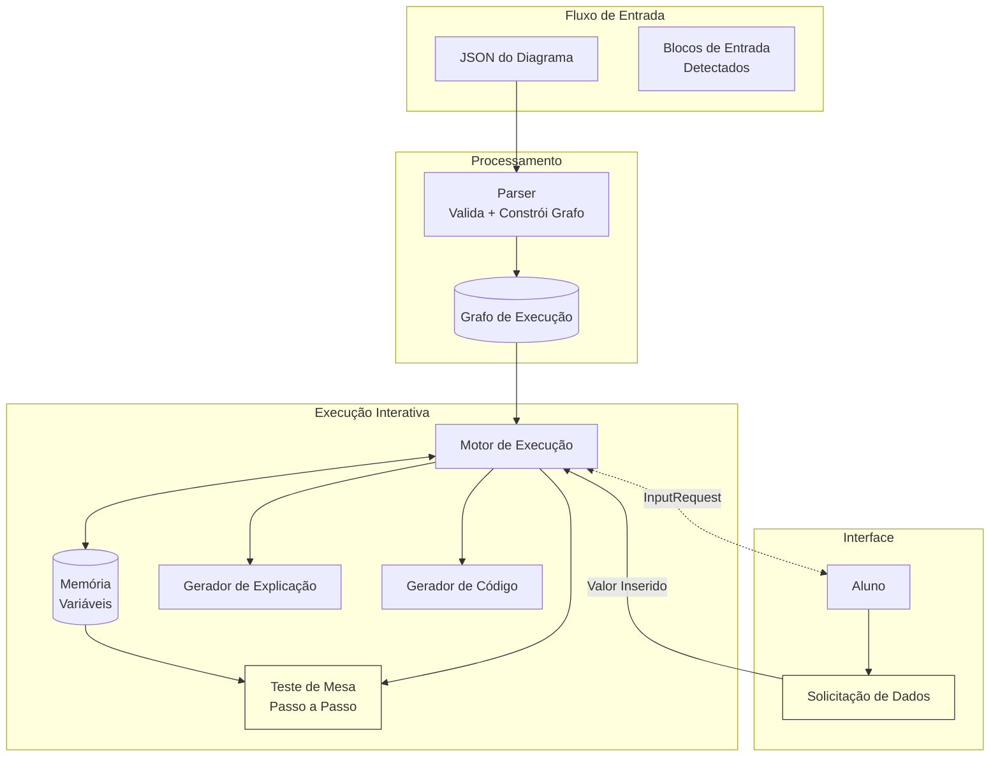
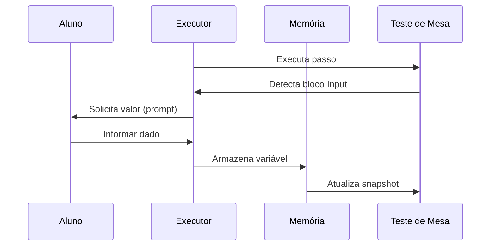

# 📄 Software Design Document (SSD)

**Projeto:** Blade – Plataforma de Ensino de Algoritmos por Diagramas de Blocos

**Autores:**
- Lucas Gontarz Fajardo
- Emanuel Oliveira Andrade

**Versão:** 1.0.0

**Status:** 🟡 Em Desenvolvimento

---

# 1. Introdução

Este documento apresenta a arquitetura de software do Blade, descrevendo a organização dos principais componentes do sistema e o fluxo de funcionamento da aplicação.

O objetivo deste documento é fornecer uma visão técnica da solução proposta, demonstrando como os módulos do sistema interagem para permitir a construção, interpretação e execução de algoritmos representados por Diagramas de Blocos.

Este documento não aborda detalhes de banco de dados, infraestrutura ou implementação específica de código, concentrando-se apenas na arquitetura lógica da aplicação.

---

# 2. Objetivos da Arquitetura

A arquitetura do Blade foi projetada visando:

- Separação clara de responsabilidades;
- Facilidade de manutenção;
- Modularização do sistema;
- Facilidade para futuras expansões;
- Reutilização de componentes;
- Independência entre construção e execução dos algoritmos.

---

# 3. Visão Geral do Sistema

O Blade é composto por dois módulos principais que trabalham de forma integrada.

- Módulo de Construção de Diagramas
- Módulo de Execução e Teste de Mesa

O primeiro é responsável pela criação e edição dos algoritmos.

O segundo interpreta o algoritmo criado, executa sua lógica e apresenta os resultados da simulação ao usuário.

---

# 4. Arquitetura Geral



A arquitetura foi organizada em módulos independentes, permitindo que alterações em um módulo causem o mínimo impacto possível nos demais.

---

# 5. Componentes do Sistema

## Interface do Usuário

Responsável pela interação entre o usuário e a plataforma.

Permite:

- construir diagramas;
- executar algoritmos;
- acompanhar a execução;
- visualizar os resultados.

---

## Módulo de Construção

Responsável pela modelagem visual dos algoritmos.

Principais responsabilidades:

- criação dos blocos;
- edição;
- conexões;
- organização do diagrama.

Ao final da modelagem, produz um diagrama estruturado que será enviado ao módulo de execução.

---

## Módulo de Execução

Responsável por interpretar o diagrama recebido.

Este módulo realiza:

- validação;
- interpretação;
- execução passo a passo;
- atualização da memória;
- geração do teste de mesa;
- geração das explicações;
- conversão para código.

---

# 6. Fluxo Geral de Funcionamento

O funcionamento do Blade ocorre conforme o fluxo abaixo.



Após a construção do algoritmo, o sistema realiza sua validação estrutural.

Caso o diagrama seja considerado válido, inicia-se a interpretação do algoritmo.

Durante a execução, o sistema atualiza continuamente a memória, gera o teste de mesa, produz explicações textuais e disponibiliza o código equivalente.

---

# 7. Módulo de Construção de Diagramas

Este módulo é responsável pela elaboração visual do algoritmo.

Suas principais funções são:

- disponibilizar os blocos da linguagem;
- permitir conexões entre blocos;
- editar propriedades dos elementos;
- validar regras básicas da construção;
- fornecer ao módulo de execução um diagrama consistente.

Este módulo não realiza qualquer processamento lógico do algoritmo.

---

# 8. Módulo de Execução e Teste de Mesa

O módulo de execução constitui o núcleo funcional da plataforma.

Seu objetivo é interpretar o algoritmo representado pelo diagrama e executar cada instrução de forma semelhante ao funcionamento de um interpretador.

Durante a execução o sistema:

- identifica o bloco atual;
- interpreta sua operação;
- atualiza as variáveis;
- registra o estado da memória;
- produz um novo passo do teste de mesa;
- gera uma explicação da operação executada.

---

# 9. Fluxo de Execução



O diagrama é inicialmente interpretado pelo Parser.

Em seguida, o Motor de Execução percorre os blocos seguindo o fluxo definido pelo algoritmo.

A cada instrução executada, a memória é atualizada e novos resultados são produzidos.

---

# 9.1. Formato JSON do Diagrama

O construtor envia o diagrama ao módulo de execução no seguinte formato:

```json
{
  "nodes": [
    { "id": "1", "type": "start", "position": { "x": 0, "y": 0 }, "data": {} },
    { "id": "2", "type": "input", "position": { "x": 100, "y": 100 }, "data": { "variable": "n" } },
    { "id": "3", "type": "process", "position": { "x": 200, "y": 200 }, "data": { "expression": "soma = n + 10" } },
    { "id": "4", "type": "output", "position": { "x": 300, "y": 300 }, "data": { "message": "soma" } },
    { "id": "5", "type": "end", "position": { "x": 400, "y": 400 }, "data": {} }
  ],
  "edges": [
    { "id": "e1-2", "source": "1", "target": "2" },
    { "id": "e2-3", "source": "2", "target": "3" },
    { "id": "e3-4", "source": "3", "target": "4" },
    { "id": "e4-5", "source": "4", "target": "5" }
  ]
}
```

---

# 9.2. Fluxo de Solicitação de Dados

Quando o teste de mesa encontra um bloco de **Entrada**, o fluxo é:



# 10. Teste de Mesa

O teste de mesa representa a execução do algoritmo de forma sequencial.

Cada linha corresponde à execução de um bloco e registra:

- passo executado;
- bloco atual;
- operação realizada;
- valores das variáveis;
- resultado produzido.

Essa representação permite acompanhar toda a evolução do algoritmo durante sua execução.

---

# 11. Conversão para Código

Além da execução visual, o Blade realiza a conversão do algoritmo para código-fonte.

Cada bloco do diagrama possui um equivalente na linguagem de programação.

Exemplos:

| Bloco | Código |
|--------|--------|
| Processo | Atribuição |
| Decisão | if |
| Enquanto | while |
| Para | for |
| Entrada | Entrada de dados |
| Saída | Impressão de dados |

O objetivo é facilitar a transição entre programação visual e programação textual.

---

# 12. Divisão dos Módulos

Para fins de desenvolvimento do Trabalho de Conclusão de Curso, a plataforma foi dividida em dois módulos.

## Módulo de Construção

Responsável:
**Emanuel Oliveira Andrade**

Escopo:

- Editor visual;
- Inserção de blocos;
- Conexões;
- Modelagem do algoritmo.

---

## Módulo de Execução

Responsável:
**Lucas Gontarz Fajardo**

Escopo:

- Interpretação;
- Execução passo a passo;
- Teste de mesa;
- Atualização da memória;
- Explicação da execução;
- Conversão para código.

Embora desenvolvidos separadamente, ambos os módulos compõem uma única aplicação.

---

# 13. Considerações Finais

A arquitetura proposta para o Blade foi organizada de forma modular, permitindo a separação entre a construção dos algoritmos e sua execução.

Essa divisão reduz o acoplamento entre os componentes, facilita futuras manutenções e possibilita a evolução independente de cada módulo.

Além disso, a arquitetura favorece a expansão da plataforma, permitindo a inclusão de novos blocos, novas linguagens de programação e novas funcionalidades sem alterações significativas na estrutura principal do sistema.